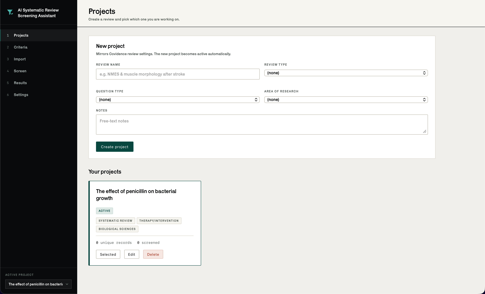
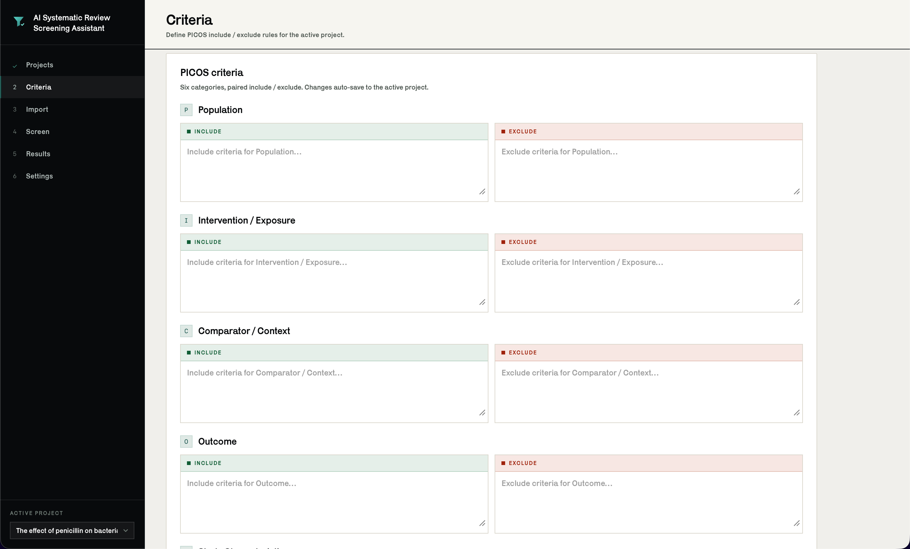
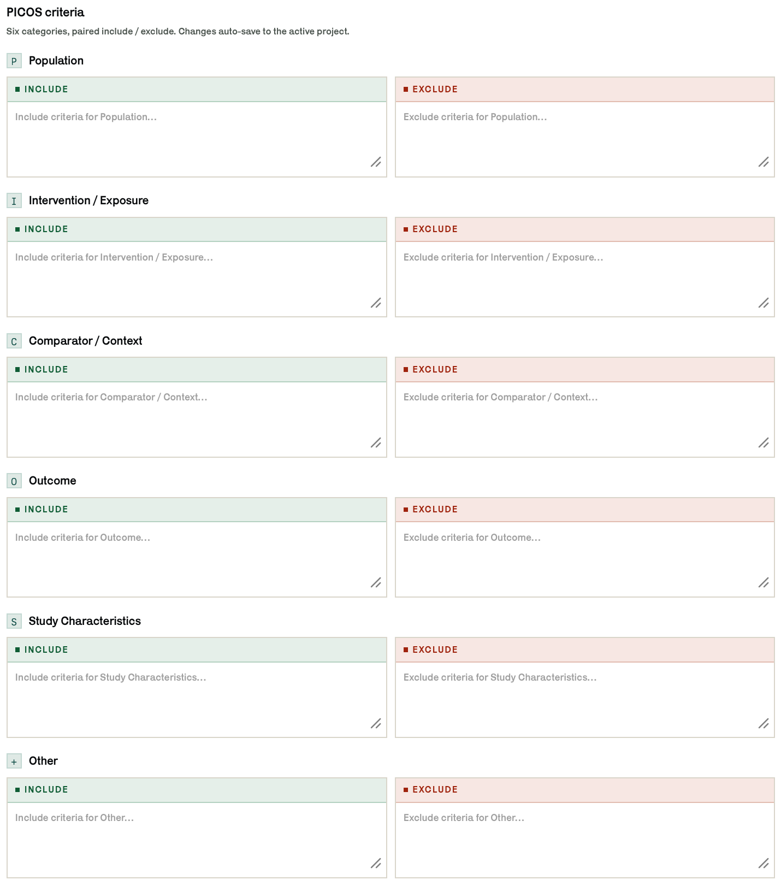
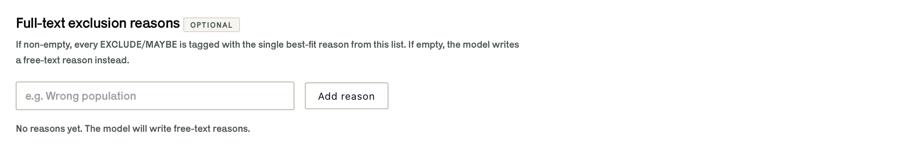
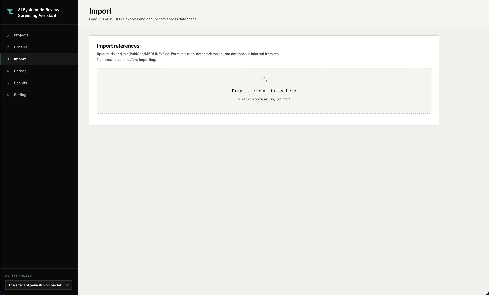
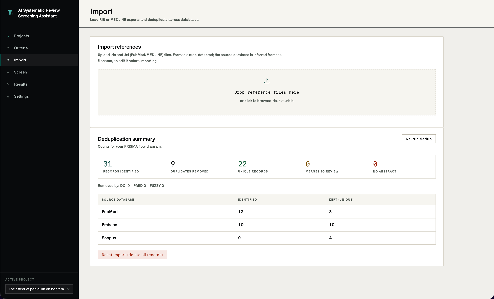
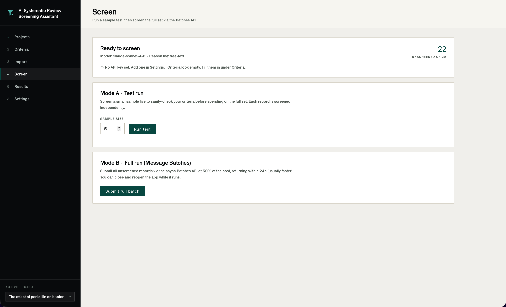
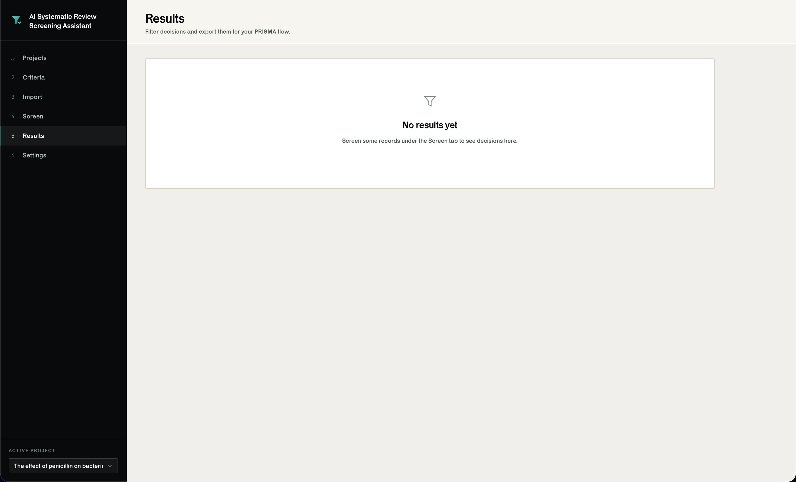
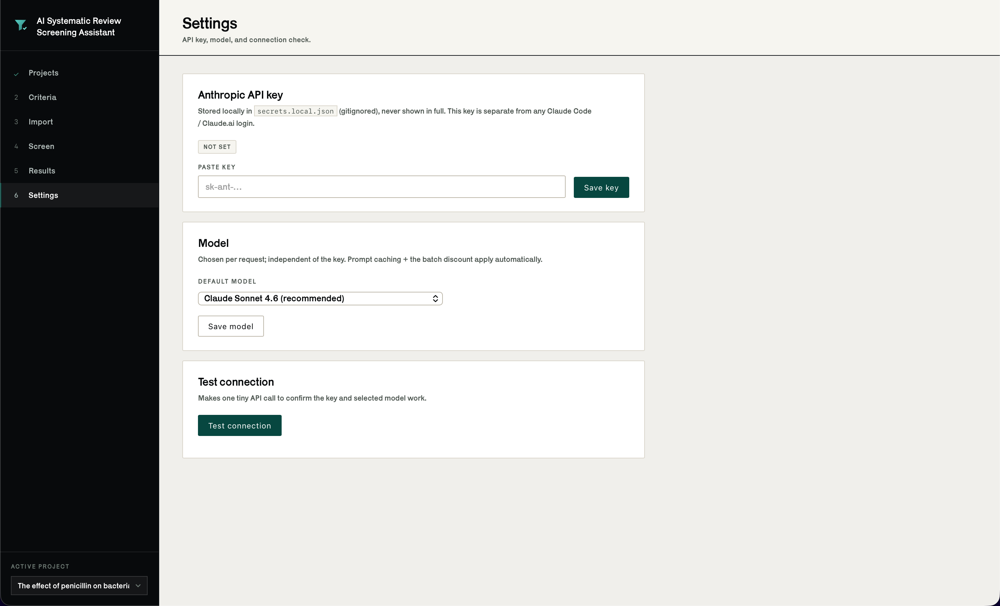

# AI Systematic Review Screening Assistant

---

## **This tool should be used as a SECOND CHECK on INDIVIDUAL screening you have already done yourself. It should NOT be a standalone screening procedure.**

**Screen your records manually first. Do the whole title/abstract pass yourself,
record your decisions, and only then run this tool over the same set and compare
the two.**

**Do NOT use this as a standalone screening step. Do NOT report its output as
your screening decisions. Do NOT let it decide anything on its own.**

The only thing this is good for is catching what you missed. When it disagrees
with you, that is a prompt to go back and look at the record again. Sometimes it
will be right and you will have missed something. Sometimes it will be wrong and
you will confirm your original call. Either way the decision stays yours, and
the audit trail you report is the one you produced by hand.

A language model does not read a paper. It pattern-matches a title and an
abstract against text you wrote. It has no idea what your review is really
about, it cannot tell a well-run trial from a bad one, and it will produce a
confident answer whether or not the abstract actually contains enough
information to decide. Treating that output as a screening pass will corrupt
your review, and it is not defensible to a reviewer or an editor.

Every major reporting standard expects screening to be done by humans, in
duplicate. This tool does not satisfy that and does not try to.

---

## Download

Grab the installer for your platform from the
[Releases page](../../releases).

### macOS

Requires macOS 11 or later.

1. Download `AI-Systematic-Review-Screening-Assistant.dmg`
2. Open it, then drag the app onto the Applications shortcut
3. First launch only: right-click the app in Applications and choose **Open**,
   then confirm

That last step is needed because the app is unsigned. A normal double-click
gives "cannot be opened because Apple cannot check it for malicious software".
You only have to do the right-click once.

### Windows

Requires 64-bit Windows 10 or later.

1. Download `AI-Systematic-Review-Screening-Assistant.msi`
2. Run it. It installs to Program Files and adds a Start menu shortcut
3. SmartScreen will show a blue warning because the installer is unsigned.
   Choose **More info**, then **Run anyway**

### What is not bundled

The installers are self-contained. They carry their own Python runtime, all
libraries, the interface, and the typeface. You do not need to install Python
or anything else to run the app.

Three things are still on you:

**An Anthropic API key.** Required. The app does nothing without one. Get it
from [console.anthropic.com](https://console.anthropic.com), then paste it into
the Settings screen. This is a paid API and you are billed for what you use.
The key is separate from a Claude.ai or Claude Code subscription, and having one
of those does not give you API access.

**An internet connection**, but only while screening. Everything else works
offline.

**Windows only: the Microsoft Edge WebView2 Runtime.** This is what draws the
app window. It ships with Windows 11 and with current Windows 10, so it is
almost certainly already there. If the app installs but the window opens blank,
install the Evergreen Runtime from
[Microsoft](https://developer.microsoft.com/microsoft-edge/webview2/) and launch
again. macOS needs no equivalent, since WKWebView is part of the system.

Your projects, records, decisions and API key are stored on your own machine and
are never uploaded anywhere. The only outbound traffic is the screening calls
you trigger.

- macOS: `~/Library/Application Support/AI Systematic Review Screening Assistant/`
- Windows: `%APPDATA%\AI Systematic Review Screening Assistant\`

These survive upgrading and uninstalling.

## How it works, and how to use it

You import your database exports, write your PICOS criteria into the app, and it
sends each record to the Anthropic API one at a time. Each record is judged in
its own request containing only your criteria and that single title and
abstract. No other study, no earlier decision, no conversation history. The
model is told explicitly that it has no memory of anything else. That makes
every decision independent and reproducible rather than drifting as it works
through a list.

Each record comes back as INCLUDE, EXCLUDE or MAYBE, with a confidence number
and a one-line reason. MAYBE is deliberately common. The model is instructed to
return it whenever the abstract is missing, the population or intervention is
ambiguous, or the call genuinely cannot be made from an abstract alone. It is
also told that anything only answerable from the full text, such as whether the
numeric data are sufficient or whether a washout was long enough, must never be
an EXCLUDE at this stage.

The intended workflow is:

1. Screen your records yourself, by hand, and record your decisions
2. Import the same records here and run the tool
3. Export the results and compare them against your own, record by record
4. For every disagreement, go back to the record and decide again yourself
5. Report your own decisions, not the tool's

If you find yourself skipping step 1, stop. The output is not a screening pass,
and the disagreements are the entire point. A run where you agree with
everything told you nothing.

## Walkthrough

The sidebar is a six step workflow. Steps show a tick once complete, so you can
see where you are.

### 1. Projects

Create a review. The fields mirror Covidence review settings: review name,
review type, question type, area of research, and free-text notes. Everything
else in the app is scoped to whichever project is active, and you can keep
several and switch between them from the selector at the bottom of the sidebar.



### 2. Criteria

Write your PICOS criteria. Six categories, each with a paired include and
exclude box, twelve boxes in total. Changes save automatically.



Population, Intervention/Exposure, Comparator/Context, Outcome, Study
Characteristics, and Other. Be specific. These boxes are the entire basis for
every decision the tool makes, and vague criteria produce vague screening.



Optionally, keep a list of exclusion reason categories. If the list has anything
in it, every EXCLUDE and MAYBE gets tagged with the single best-fit reason from
your list, which is what you want for a PRISMA flow diagram. Leave it empty and
the model writes a free-text reason instead.



### 3. Import

Drop in your `.ris` and `.txt` (PubMed/MEDLINE) exports. The format is detected
from the file contents, and the source database is guessed from the filename so
you can correct it before importing.



After importing you get deduplication counts ready for a PRISMA diagram: records
identified, duplicates removed, unique records left, and a per-database
breakdown. Deduplication runs in layers, first exact DOI, then PMID, then a
fuzzy title match for records missing both identifiers, which also requires the
same year and the same first author surname.

Borderline fuzzy matches are not merged silently. Anything in the uncertain band
goes to a review queue for you to confirm or split by hand.



### 4. Screen

Two modes.

**Mode A, Test run.** Screens a small sample live so you can sanity-check your
criteria before spending money on the whole set. Always do this first. If the
sample decisions look wrong, the problem is your criteria, and fixing them now
costs nothing.

**Mode B, Full run.** Submits every unscreened record through the Message
Batches API, which costs half as much and returns within 24 hours, usually much
sooner. You can close the app while it runs. Progress is saved as results come
back, so nothing is lost if you quit or crash, and re-running skips records that
are already screened.

The panel at the top warns you about anything missing, such as an unset API key
or empty criteria, before you spend anything.



### 5. Results

Every decision in a filterable table: decision, confidence, title, year, source
databases, reason, category and tags. Filter by decision, exclusion category,
tag, or whether the record had an abstract at all.

Three exports:

- **RIS**, the includes (and optionally maybes), ready to load straight into
  Covidence, Rayyan or EndNote for full-text screening
- **CSV**, the decision table as a spreadsheet, with abstracts optional
- **PRISMA counts**, stage-by-stage numbers for your flow diagram

This is the screen you use for the comparison against your own decisions. Export
the CSV and put it next to your manual results.



### 6. Settings

Paste your Anthropic API key, pick a model, and run a connection test that makes
one tiny call to confirm the key and model both work.

The key is stored locally in `secrets.local.json` alongside your database, with
restricted file permissions, and is never shown back to you in full. It is not
committed anywhere and it is separate from any Claude.ai or Claude Code login.



## Keyboard shortcuts

`Ctrl` on Windows, `Cmd` on macOS.

| | |
|---|---|
| Zoom in / out / reset | `+` / `-` / `0`, or Ctrl and scroll wheel |
| Find in page | `F`, then `Enter` / `Shift+Enter` to cycle matches |
| Jump to a section | `1` to `6` |
| Reload | `R` |
| Close find or dialog | `Esc` |
| Show the shortcut list | `/` or `?` |

## Building from source

You need Python 3.11 and the matching operating system. Neither installer can be
built from the other platform, because PyInstaller cannot cross-compile.

```bash
# macOS, produces dist/AI-Screening-Assistant-1.0.0.dmg
python -m venv .venv && source .venv/bin/activate
pip install -r requirements.txt -r requirements-desktop.txt
./packaging/macos/build.sh 1.0.0
```

```powershell
# Windows, produces dist\AI-Screening-Assistant-1.0.0.msi
python -m venv .venv; .venv\Scripts\Activate.ps1
pip install -r requirements.txt -r requirements-desktop.txt
powershell -ExecutionPolicy Bypass -File packaging\windows\build.ps1 -Version 1.0.0
```

To run without packaging, `python desktop.py` opens the same window. Data goes
to `./data` instead of the per-user location.

CI builds both installers on their own runners. Push a tag to cut a release:

```bash
git tag v1.0.0 && git push origin v1.0.0
```

## Tests

Plain scripts, no pytest, no API key or network needed.

```bash
python tests/test_import_dedup.py    # parsing and layered dedup
python tests/test_screen.py          # JSON parsing, independence, sync and batch
python tests/test_results.py         # results filters and exports
```

## Credits

The interface is set in **Karrik** by Jean-Baptiste Morizot and Lucas Le Bihan,
published by [Velvetyne](https://velvetyne.fr/fonts/karrik/), used under the SIL
Open Font License 1.1. The font files and the licence text ship with the app in
`app/static/fonts/`.
